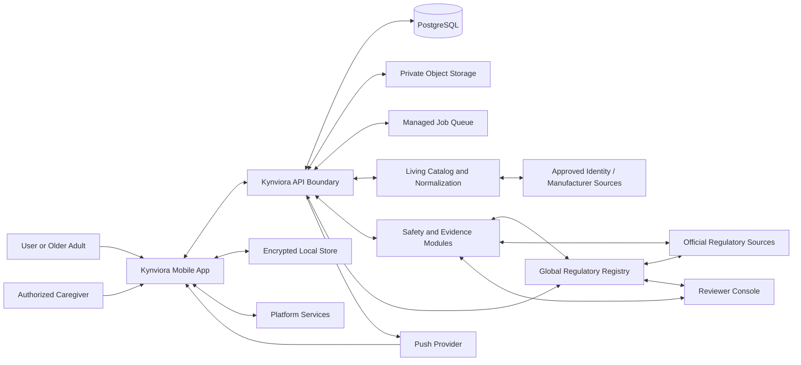
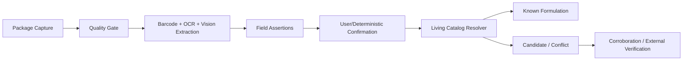
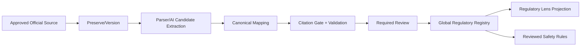

# System Architecture

Status: Architecture source of truth
Last reviewed: 2026-08-29

## Architecture goal

Build Kynviora as a production-shaped, explainable, offline-capable mobile product in which
safety decisions are server-authoritative, reproducible, and independently reviewable.

## Current baseline

As of 2026-08-20, the recommended mobile baseline is:

- Expo SDK 57.
- React Native 0.86.
- React 19.2.x as required by the Expo SDK line.
- Strict TypeScript.
- Expo Router.
- Android-first delivery with iOS kept as a supported second client through platform ports.

Pin exact versions in the lockfile and use Expo-compatible package installation for native
libraries. Revisit versions through an ADR rather than opportunistic upgrades.

## Architecture principles

- Modular monolith before microservices.
- Server-authoritative safety and caregiver authorization.
- Offline-first user-owned care records.
- Deterministic rules for safety outcomes.
- Explicit versioning and provenance at data boundaries.
- Deny by default.
- Platform-specific behavior behind interfaces.
- No business logic in route files.
- No sensitive information in URLs, logs, analytics, or lock-screen notifications by default.
- High-risk remote behavior must have disable/rollback controls.

## System context

## Data authority boundaries added by the Living Catalog

- **Package evidence** is authoritative only for what is visibly/explicitly captured and confirmed on that package.
- **Living Catalog** stores shared product/formulation knowledge and corroboration; it is not personal health history.
- **Normalization vocabularies** provide canonical identifiers; they do not create safety conclusions.
- **Global Regulatory Registry** stores jurisdiction-specific regulatory facts backed by approved source evidence.
- **Safety engine** may depend on regulatory records but applies a separately versioned deterministic policy to create user assessments.
- **AI/research agents** create candidates and drafts only. They have no shared catalog, regulatory, rule, or alert publication authority.

### Product-data path

### Regulatory-data path

## Major system boundaries

### Mobile application

Owns:

- user interaction;
- local durable projection;
- capture/scanning;
- local medicine reminders;
- offline edits;
- presentation of server-authoritative assessments;
- platform adapters.

Does not own:

- safety severity;
- evidence ingestion;
- provider credentials;
- caregiver authorization truth;
- shared catalog publication;
- high-impact rule publication.

### API boundary

Owns authenticated resource access, validation, idempotency, authorization, sync, exports, and
orchestration of domain modules.

For the MVP, Supabase can provide PostgreSQL, Auth, private Storage, and selected Edge Function
infrastructure, but the mobile client should not gain broad direct authority simply because
RLS exists. Safety-sensitive mutations and privileged workflows go through controlled server
functions/API services with RLS remaining defense in depth.

### Transactional database

PostgreSQL is authoritative for user metadata, grants, item records, schedules, evidence
metadata, assessments, publications, consent, audit events, and operational workflow state.

### Object storage

Private storage for user evidence and preserved source material where licensing allows.
Objects are accessed through authorization-checked short-lived mechanisms, never public paths.

### Safety/evidence workers

Separately scalable workers handle ingestion, parsing, normalization, matching, replay, and
other asynchronous tasks. They do not bypass publication governance.

### Reviewer console

Internal privileged application for source review, rule review, shadow results, publication,
withdrawal, and correction. It has stronger authentication and audit requirements than a
normal user client.

## Module boundaries

Recommended backend modules:

- identity/session;
- household/profile/consent;
- caregiver authorization;
- item catalog and formulation;
- owned Shelf;
- medicine care;
- review tasks/appointments;
- documents/evidence assets;
- source registry/ingestion;
- evidence normalization;
- rule/assessment engine;
- publication/notifications;
- export/Visit Pack;
- audit/compliance;
- operations/admin.

Modules share a database initially but own their tables/contracts logically. Cross-module
writes should be explicit use cases or transactions, not arbitrary imports from UI code.

## Data authority matrix

### Local-first, synchronized

- user-entered Shelf items;
- schedules;
- dose events;
- appointments/review tasks;
- user notes;
- draft capture state.

### Server-authoritative

- caregiver grants;
- shared catalog review status;
- source registry;
- evidence claims;
- rule versions;
- safety assessments;
- alert publications;
- consent/audit states that affect authorization;
- deletion/export job status.

### Device-authoritative conveniences

- local notification scheduling state;
- biometric convenience setting;
- ephemeral UI preferences that do not change server authorization.

## Trust boundaries

High-value boundaries include:

- untrusted external source -> ingestion worker;
- uploaded image/document -> processing pipeline;
- mobile client -> API;
- caregiver user -> another person's profile;
- reviewer console -> publication system;
- generative AI -> deterministic/reviewed workflow;
- remote update -> installed native runtime;
- notification payload -> authenticated current alert.

Each is covered by the threat model.

## Failure philosophy

When uncertain or partially unavailable:

- preserve last trusted safety assessment;
- show timestamp/coverage limitation;
- do not promote partial data into a stronger conclusion;
- let low-risk user work continue offline;
- quarantine bad source/parser data;
- fail closed for authorization and privileged publication;
- provide a user-correctable route when appropriate.

## Architecture decision records

Create an ADR for choices that are expensive to reverse, including:

- authentication provider/method;
- encrypted SQLite implementation;
- backend API versus direct Supabase access boundaries;
- OCR provider/on-device strategy;
- first commercial catalog provider;
- source preservation strategy;
- notification provider abstraction;
- analytics/crash tooling;
- queue/search infrastructure;
- remote update policy;
- iOS health adapter decisions.
