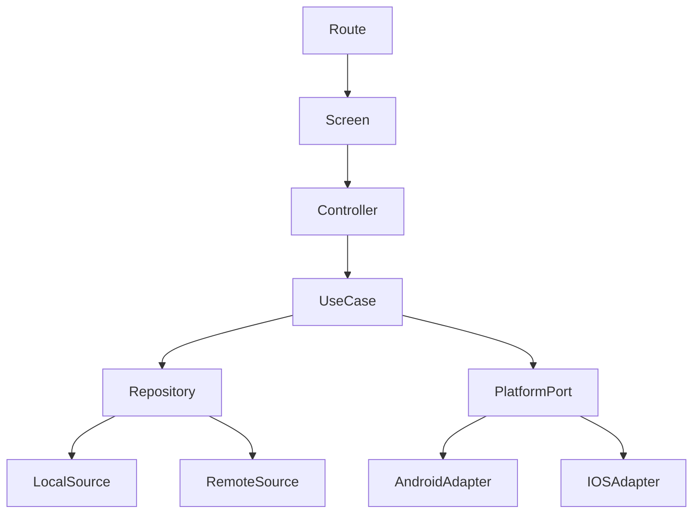

# Mobile Architecture

Status: Engineering source of truth
Last reviewed: 2026-08-20

## Goal

Create an Android-first React Native application that remains iOS-capable, works reliably
offline for daily care, and cannot independently invent or upgrade safety conclusions.

## Technology baseline

- Expo SDK 57.
- React Native 0.86.
- Strict TypeScript.
- Expo Router.
- Expo development builds for camera, secure storage, notifications, and native modules.
- React Native Testing Library for component tests.
- Maestro or equivalent device E2E tests.
- Runtime schema validation at network and persistence boundaries.

## Recommended project structure

```text
src/
  app/                   # routes/composition only
  components/            # accessible shared UI primitives
  features/
    auth/
    profiles/
    shelf/
    medicines/
    personalCare/
    capture/
    safety/
    caregivers/
    care/
    visitPack/
  domain/                # stable entities, value objects, contracts
  repositories/          # interfaces + implementations
  services/              # api, sync, notifications, telemetry
  storage/               # schema, migrations, encryption, recovery
  platform/              # Android/iOS adapters
  theme/
  validation/
  utils/
modules/                  # narrow custom Expo modules if needed
__tests__/
```

Route files do not contain SQL, API authorization logic, provider credentials, safety rules,
or evidence classification.

## Dependency flow



Dependencies point toward domain contracts. Shared/domain code never imports screen modules.

## State categories

### Ephemeral UI state

Examples: selected tab, temporary filter, open sheet.

Owner: local screen/controller.

### Draft state

Examples: unconfirmed OCR fields, partly completed product capture.

Owner: feature draft store with explicit persistence when interruption should be recoverable.

### Durable user state

Examples: medicines, schedules, owned products, profile context.

Owner: repository backed by encrypted local database and sync.

### Server-authoritative state

Examples: safety assessments, caregiver permissions, publication/correction state.

Owner: server synchronized into a read projection. Client may cache but not authoritatively
mutate outcome fields.

## Offline storage

Before real health data is enabled:

- select an encrypted SQLite strategy compatible with the Expo/native build approach;
- generate a per-install database key;
- protect key material through Android Keystore/iOS Keychain via reviewed mechanism;
- use forward-only migrations with tested recovery;
- separately encrypt sensitive files/evidence assets;
- remove temporary capture/OCR files;
- define backup exclusion/recovery behavior;
- never use AsyncStorage for health records, tokens, consent, or safety data.

SecureStore/Keychain/Keystore storage is for small credentials/key material, not the complete
health database.

## Repository behavior

Screens read local state immediately. Repositories manage:

- local query/write;
- pending-operation journal;
- remote validation;
- idempotency keys;
- conflict status;
- sync metadata;
- server-authoritative replacements.

Optimistic updates are allowed only for low-risk user-owned changes. Do not optimistically
change caregiver grants or safety severity/publication state.

## Sync behavior

- Every pending mutation has stable client operation ID/idempotency key.
- Pull uses a household/profile-scoped change cursor.
- Apply remote changes transactionally.
- Advance cursor only after local commit.
- Sign-out removes decrypted projections and caches.
- Authorization loss invalidates local access.
- Profile conflicts use explicit resolution policy, not blind last-write-wins.

## Capture architecture

Camera/barcode/OCR is a pipeline:

1. permission;
2. capture;
3. quality validation;
4. local normalization where safe;
5. provider/backend proposal;
6. field-confidence display;
7. user confirmation;
8. durable assertion/evidence save;
9. assessment request/sync.

Keep capture drafts resumable after interruption where feasible.

## Notifications

### Medicine reminders

Scheduled locally because daily reminders should not depend on server connectivity.

### Safety notifications

Server initiates a minimal/generic notification. Opening it:

1. restores authenticated context;
2. verifies current authorization;
3. fetches/synchronizes current alert version;
4. displays current data, not stale push content.

## Platform ports

Create interfaces for:

- secure key/session storage;
- biometrics convenience;
- notifications;
- camera/media;
- file/share/print;
- health data (future only if approved);
- background sync.

Use `*.android.ts`/`*.ios.ts` or custom Expo modules behind those contracts.

## Accessibility architecture

Shared components should enforce:

- semantic labels/roles/states;
- minimum touch targets;
- focus restoration;
- large text support;
- status label plus icon/text, not color only;
- reduced-motion handling;
- screen-reader announcements for meaningful live updates.

Critical accessibility behavior belongs in component APIs so each feature does not reinvent it.

## Error handling classes

- Recoverable network/offline.
- User-correctable input/capture.
- Permission denied.
- Authorization lost.
- Sync conflict.
- Integrity/storage failure.
- Safety payload validation failure.

A malformed safety payload must not replace the last trusted assessment.

## Performance priorities

Prioritize:

- fast local Today/Shelf load;
- responsive profile switching;
- bounded image memory usage;
- background upload/sync that does not block core navigation;
- large Shelf list virtualization;
- no heavy research/source processing on device.

## Web support

Web can remain an internal preview/admin convenience during MVP unless explicitly approved as
a user platform. Do not persist sensitive web sessions or claim parity until a web-specific
security/threat model is complete.
